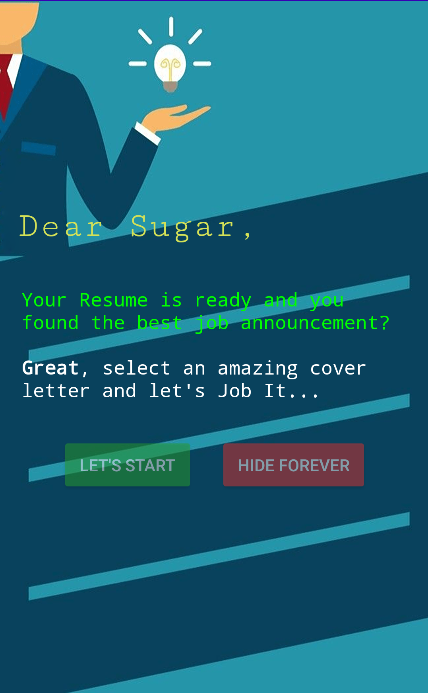
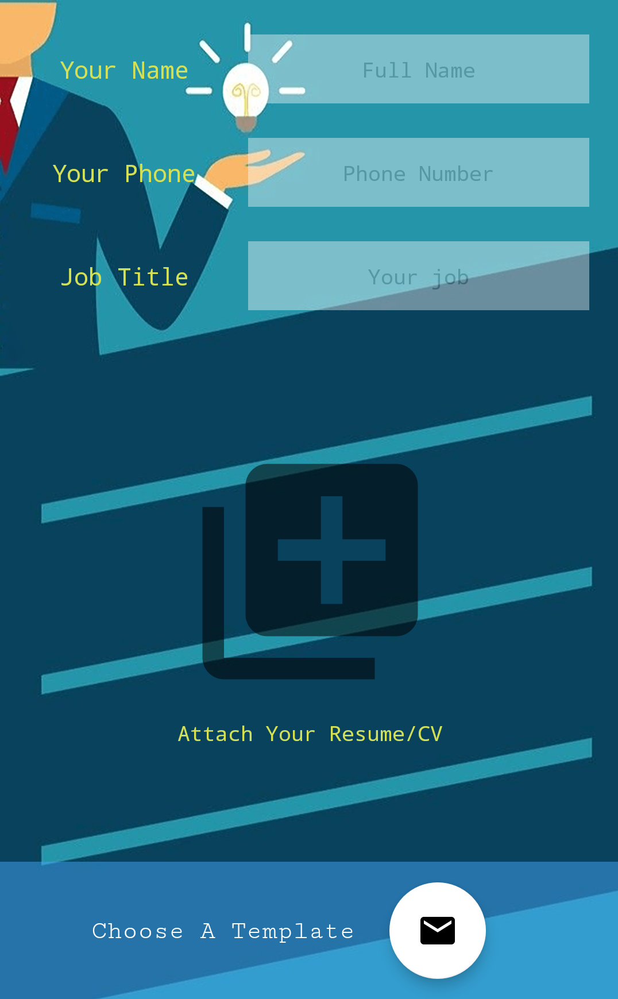
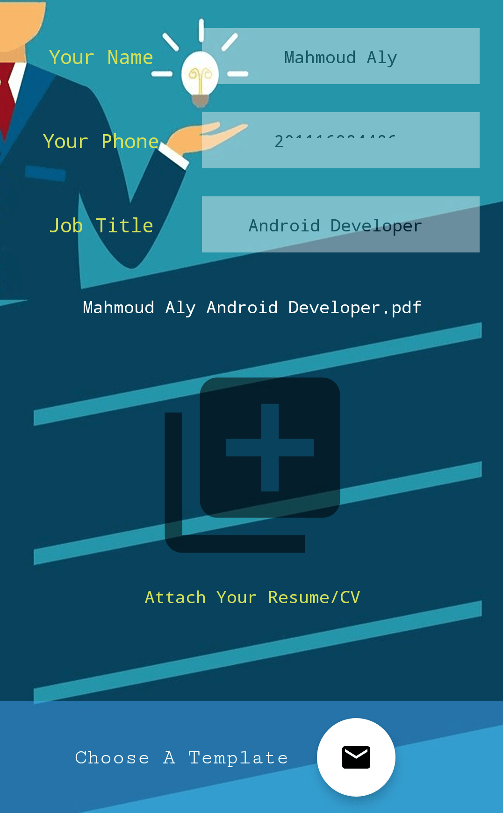
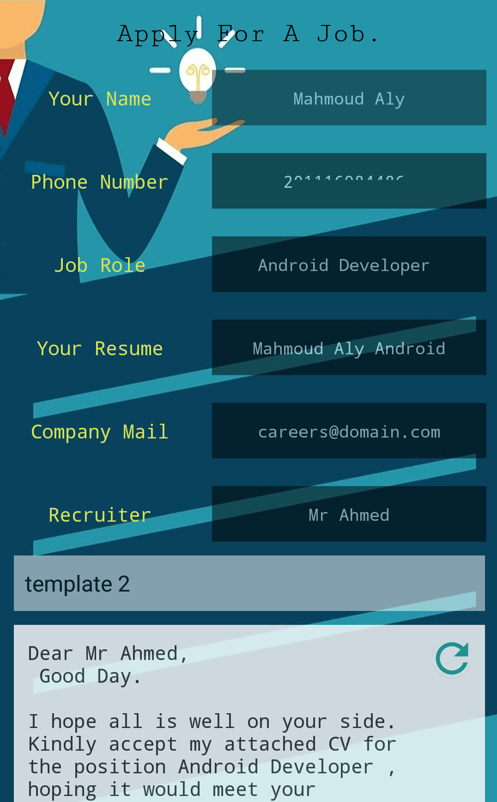
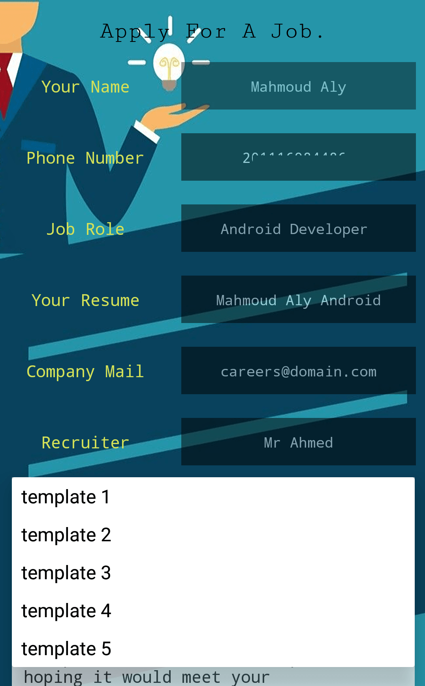
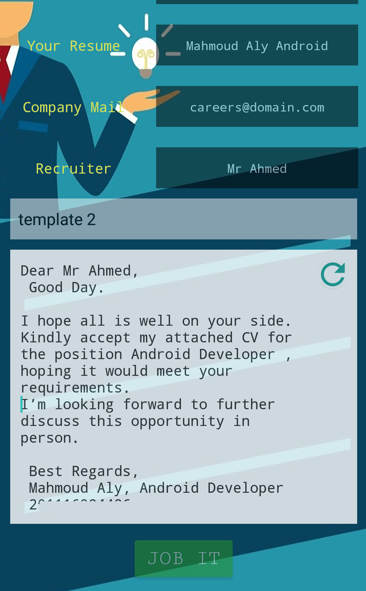
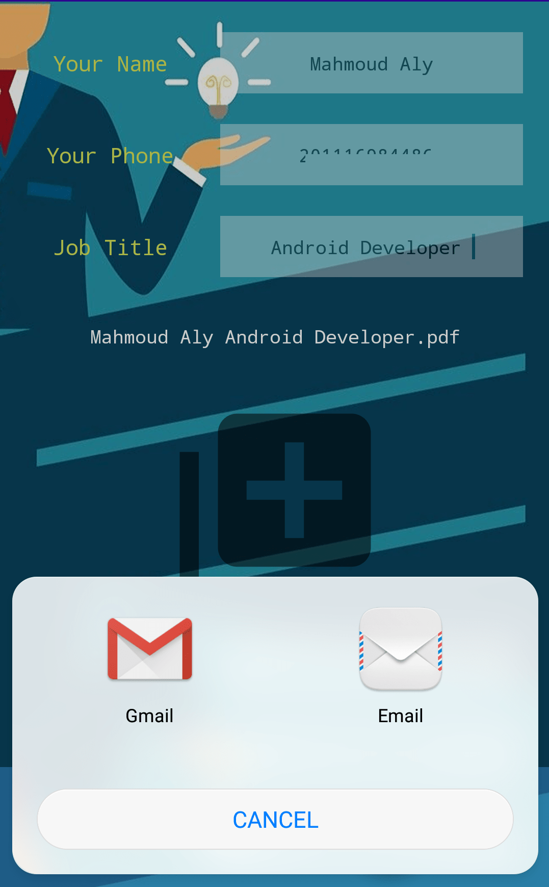
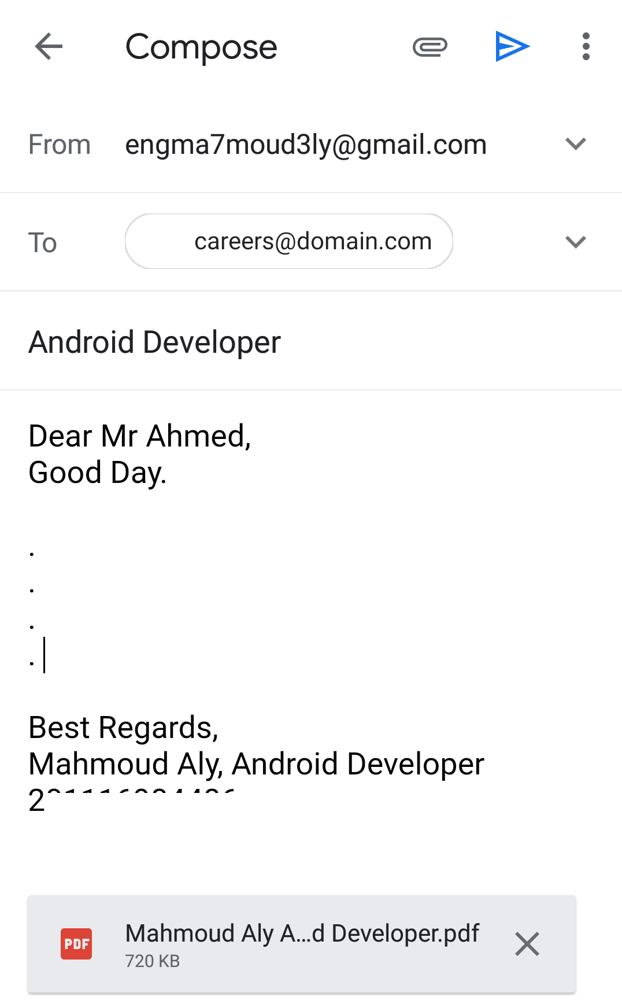

<div align="center">
  <a href="https://play.google.com/store/apps/details?id=com.ma7moud3ly.jobit" target="_blank">
    
  </a>

# [Job IT](https://play.google.com/store/apps/details?id=com.ma7moud3ly.jobit) 
```
Job It: is a professional job E-mail creator.
```
<div align="left">
With Job it
<li>You don't have to build from scratch an email for every job you apply for.</li>
<li>Just enter your job information and attach you Resume/CV and Job It will do it.</li>
<li>Select one professional email template edited and created for your data.</li>
<li>Make no changes or make them, then forward the job email to your favourite mailing application.</li>
</div>
<br>
<div>
  
  
</div>
<br>
<div>
  
  
</div>
<br>
<div>
  
  
</div>
<br>
<div>
  
  
</div>
<br>
[Download From Google Play](https://play.google.com/store/apps/details?id=com.ma7moud3ly.jobit) 
</div>
